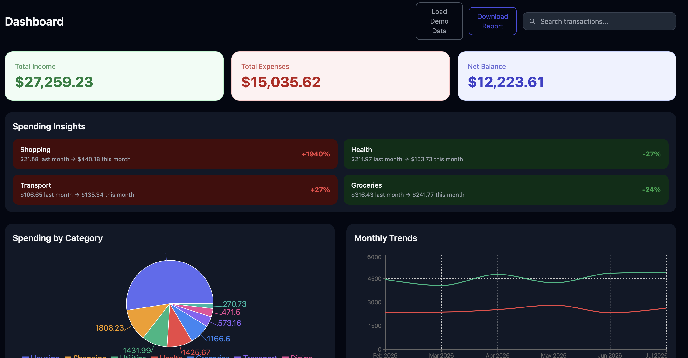
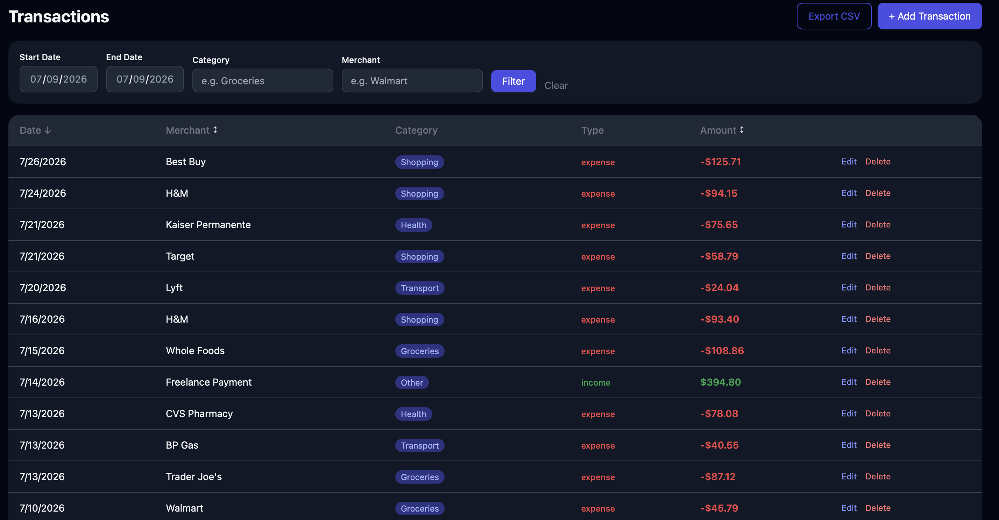

# FinSight

[](https://github.com/marcusashmond/FinSight/actions/workflows/ci.yml)

**Live Demo:** [fin-sight-beta-eosin.vercel.app](https://fin-sight-beta-eosin.vercel.app)

A full-stack personal finance dashboard for tracking income, expenses, budgets, and net worth. Built with React, Node/Express, and MongoDB Atlas.

## Screenshots





## Features

- **Dashboard** — Income/expense summary cards, spending by category (pie chart), monthly trends (line chart), month-over-month spending insights, live transaction search, and CSV report download
- **Transactions** — Add, edit, and delete transactions; filter by date range, category, and merchant; sortable columns; server-side pagination; CSV export
- **Budgets** — Set spending limits per category, live progress bars with 80% warning and over-budget alerts, budget vs spending bar chart, in-app notification bell
- **Net Worth** — Track assets and liabilities, automatic net worth calculation
- **Goals** — Savings goals with progress bars, contributions, and days remaining
- **Recurring** — Subscription tracker with monthly cost estimates
- **Upload** — Import transactions from CSV bank exports with field mapping and import summary
- **Auth** — JWT-based authentication, profile management, password change, dark mode

## Tech Stack

**Frontend:** React 18, Vite, Tailwind CSS, Recharts, Axios, React Router  
**Backend:** Node.js, Express, MongoDB Atlas, Mongoose, JWT, Joi  
**Testing:** Jest, Supertest, mongodb-memory-server  
**CI/CD:** GitHub Actions → Vercel (frontend) + Render (backend)

## Getting Started

### Prerequisites
- Node.js 18+
- MongoDB Atlas account

### Backend

```bash
cd backend
cp .env.example .env   # fill in MONGO_URI and JWT_SECRET
npm install
npm run dev
```

### Frontend

```bash
cd frontend
npm install
npm run dev
```

Open [http://localhost:5173](http://localhost:5173)

### Environment Variables

| Variable | Description |
|----------|-------------|
| `MONGO_URI` | MongoDB Atlas connection string |
| `JWT_SECRET` | Secret key for signing JWTs |
| `JWT_EXPIRES_IN` | Token expiry (default: `7d`) |
| `PORT` | Server port (default: `3001`) |

## API Overview

| Method | Endpoint | Description |
|--------|----------|-------------|
| POST | `/api/auth/register` | Register new user |
| POST | `/api/auth/login` | Login |
| GET | `/api/auth/me` | Get current user |
| PATCH | `/api/auth/me` | Update profile name |
| PATCH | `/api/auth/me/password` | Change password |
| GET | `/api/transactions` | List transactions (filter, sort, paginate) |
| POST | `/api/transactions` | Create transaction |
| PATCH | `/api/transactions/:id` | Update transaction |
| DELETE | `/api/transactions/:id` | Delete transaction |
| GET | `/api/budgets` | List budgets |
| POST | `/api/budgets` | Create or update budget |
| DELETE | `/api/budgets/:id` | Delete budget |
| GET | `/api/analytics/summary` | Income/expense summary |
| GET | `/api/analytics/categories` | Spending by category |
| GET | `/api/analytics/trends` | Monthly trends |
| GET | `/api/analytics/insights` | Month-over-month category changes |
| GET | `/api/assets` | List assets and liabilities |
| POST | `/api/assets` | Add asset or liability |
| DELETE | `/api/assets/:id` | Delete asset |
| GET | `/api/goals` | List savings goals |
| POST | `/api/goals` | Create goal |
| PATCH | `/api/goals/:id` | Update goal (contributions) |
| DELETE | `/api/goals/:id` | Delete goal |
| GET | `/api/subscriptions` | List subscriptions |
| POST | `/api/subscriptions` | Add subscription |
| DELETE | `/api/subscriptions/:id` | Delete subscription |
| POST | `/api/upload` | Upload CSV bank export |

## Project Structure

```
FinSight/
├── backend/
│   └── src/
│       ├── controllers/
│       ├── middleware/
│       ├── models/
│       ├── routes/
│       ├── services/
│       ├── __tests__/
│       └── app.js
└── frontend/
    └── src/
        ├── components/
        ├── context/
        ├── hooks/
        ├── pages/
        └── services/
```

## License

MIT
